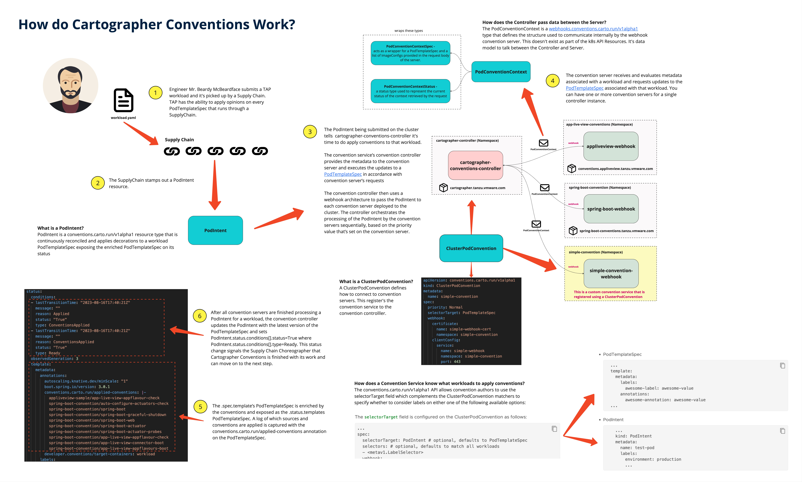

# Multi-Purpose Convention Server

A sample convention server for adding in liveiness/readiness/startup probes, volumes/volume mounts, container arguments, node affinity, tolerations, and environment variables to a pod spec for a TAP workload.

**Disclaimer:** This is not an officially supported Convention Service from VMware.

## Component Overview

This project can be used as a template/exemplar to create your own conventions for a Supply Chain. Boilerplate code with a handler and convention interface has been moved to the convention-server-framework package. To reuse this code you just need to implement your own convention.go logic. 

### server.go

This creates a basic http server to handle webhook calls from the Convention controller. It calls the handler to execute your conventions. 

This component shouldn't need changes (unless you have different logging needs, etc.)

### convention.go 

This contains the logic for your conventions. Each convention is part of variable array that overrides the functions in the convention interface from the framework package. 

## Convention Architecture

[Cartographer Convention Documentation](https://docs.vmware.com/en/VMware-Tanzu-Application-Platform/1.6/tap/cartographer-conventions-about.html)



## Prequisites

* [Golang 1.20+](https://go.dev/doc/install)
```shell
brew install go
```
* [Pack CLI](https://buildpacks.io/docs/tools/pack/)
```shell
brew install buildpacks/tap/pack
```
* [Set the default builder](https://buildpacks.io/docs/tools/pack/cli/pack_config_default-builder/)
```shell
pack config default-builder paketobuildpacks/builder-jammy-tiny
```
* [Tanzu CLI](https://docs.vmware.com/en/VMware-Tanzu-Application-Platform/1.6/tap/install-tanzu-cli.html)

* [Kctrl CLI](https://github.com/carvel-dev/carvel) - Needed for bundling and releasing as a Carvel Package

* [jq](https://jqlang.github.io/jq/)

* [gsed](https://formulae.brew.sh/formula/gnu-sed)

## Available Options

| Annotation | Description | 
| --- | --- |
| `example.com/livenessProbe` | define a liveness probe | 
| `example.com/readinessProbe` | define a readiness probe |
| `example.com/startupProbe` | define a startup probe |
| `example.com/storage` | define volume and volume mounts |
| `example.com/args` | define container args |
| `example.com/tolerations` | define tolerations for a pod |
| `example.com/nodeSelector` | define a node selector for a pod |
| `example.com/affinity` | define scheduling affinity for a pod |

## Example Annotations for a Workload

```yaml
spec:
  params:
  - name: annotations
    value:
      example.com/livenessProbe: '{"exec":{"command":["cat","/tmp/healthy"]},"initialDelaySeconds":5,"periodSeconds":5}'
      example.com/readinessProbe: '{"httpGet":{"path":"/healthz","port":8080},"initialDelaySeconds":5,"periodSeconds":5}'
      example.com/startupProbe: '{"httpGet":{"path":"/healthz","port":"liveness-port"},"failureThreshold":30,"periodSeconds":10}'
      example.com/storage: '{"volumes":[{"name":"config-vol","configMap":{"name":"log-config","items":[{"key":"log_level","path":"log_level"}]}}],"volumeMounts":[{"name":"config-vol","mountPath":"/etc/config"}]}'
      example.com/args: '{["HOSTNAME","KUBERNETES_PORT"]}'
      example.com/tolerations: '[{"key":"rabeyta","operator":"Exists","effect":"NoSchedule"}]'
      example.com/nodeSelector: '{"disktype":"ssd"}'
      example.com/affinity: '{"nodeAffinity":{"requiredDuringSchedulingIgnoredDuringExecution":{"nodeSelectorTerms":[{"matchExpressions":[{"key":"topology.kubernetes.io/zone","operator":"In","values":["antarctica-east1","antarctica-west1"]}]}]},"preferredDuringSchedulingIgnoredDuringExecution":[{"weight":1,"preference":{"matchExpressions":[{"key":"another-node-label-key","operator":"In","values":["another-node-label-value"]}]}}]}}'

```

It can sometimes be tricky to convert yaml to json to pass through the annotation. You can use these utilities:

* [Convert Yaml to JSON](https://onlineyamltools.com/convert-yaml-to-json)
* [Compact JSON](https://www.text-utils.com/json-formatter/)

## Example Workload

Below is an example workload that configured two probes.

```yaml
apiVersion: carto.run/v1alpha1
kind: Workload
metadata:
  labels:
    app.kubernetes.io/part-of: app-golang-kpack
    apps.tanzu.vmware.com/workload-type: web
  name: convention-workload
  namespace: jeremy
spec:
  params:
  - name: annotations
    value:
      example.com/livenessProbe: '{"exec":{"command":["cat","/tmp/healthy"]},"initialDelaySeconds":5,"periodSeconds":5}'
      example.com/readinessProbe: '{"httpGet":{"path":"/healthz","port":8080},"initialDelaySeconds":5,"periodSeconds":5}'
  source:
    git:
      ref:
        branch: main
      url: https://github.com/carto-run/app-golang-kpack   
```

You can find more examples in the [workload-examples folder](/workload-examples/) in the repository.

## Example Generated PodSpec with Probes

```yaml
...
spec:
  containers:
  - image: gcr.io/ship-interfaces-dev/supply-chain/app-golang-kpack-dev@sha256:3830de13d0a844420caa3d0a8d77ee1ca5b05897a273465c682032522fc331b5
    livenessProbe:
      exec:
        command:
        - cat
        - /tmp/healthy
      initialDelaySeconds: 5
      periodSeconds: 5
    name: workload
    readinessProbe:
      httpGet:
        path: /healthz
        port: 8080
      initialDelaySeconds: 5
      periodSeconds: 5
    resources: {}
...
```

## Install on a Cluster

The multi-purpose-convention-server has been conveniently packaged up via Carvel and can be installed on a TAP cluster via the Tanzu CLI.

### Install via Carvel Package

Run the following command to output a list of available tags.

  ```shell
  imgpkg tag list -i projects.registry.vmware.com/tanzu_practice/conventions/multi-purpose-convention-server-bundle-repo | sort -V
  ```

  For example:

  ```shell
  imgpkg tag list -i projects.registry.vmware.com/tanzu_practice/conventions/multi-purpose-convention-server-bundle-repo | sort -V

  0.1.0
  0.2.0
  0.3.0
  0.4.0
  ```

Use the latest version returned by the command above.

We recommend to relocate the images from VMware Tanzu Network registry to
your own container image registry before installing.

1. Set up environment variables for installation by running:

    ```shell
    export INSTALL_REGISTRY_USERNAME=MY-REGISTRY-USER
    export INSTALL_REGISTRY_PASSWORD=MY-REGISTRY-PASSWORD
    export INSTALL_REGISTRY_HOSTNAME=MY-REGISTRY
    export VERSION=VERSION-NUMBER
    export INSTALL_REPO=TARGET-REPOSITORY
    ```

    Where:

    - `MY-REGISTRY-USER` is the user with write access to MY-REGISTRY.
    - `MY-REGISTRY-PASSWORD` is the password for `MY-REGISTRY-USER`.
    - `MY-REGISTRY` is your own registry.
    - `VERSION` is your Multi-Purpose-Convention-Server version. For example, `0.4.0`.
    - `TARGET-REPOSITORY` is your target repository, a directory or repository on
      `MY-REGISTRY` that serves as the location for the installation files for
      the conventions.

2. Relocate the images with the imgpkg CLI by running:

    ```shell
    imgpkg copy -b projects.registry.vmware.com/tanzu_practice/conventions/multi-purpose-convention-server-bundle-repo:${VERSION} --to-repo ${INSTALL_REGISTRY_HOSTNAME}/${INSTALL_REPO}/multi-purpose-convention-server-bundle-repo
    ```

3. Add Multi-Purpose-Convention-Server package repository to the cluster by running:

    ```shell
    tanzu package repository add multi-purpose-conventions-repository \
      --url ${INSTALL_REGISTRY_HOSTNAME}/${INSTALL_REPO}/multi-purpose-convention-server-bundle-repo:$VERSION \
      --namespace tap-install
    ```

4. Get the status of Multi-Purpose-Convention-Server  package repository, and ensure that the status updates to `Reconcile succeeded` by running:


    ```shell
    tanzu package repository get multi-purpose-conventions-repository --namespace tap-install
    ```

    For example:

    ```console
    tanzu package repository get multi-purpose-conventions-repository --namespace tap-install

    NAMESPACE:               tap-install
    NAME:                    multi-purpose-conventions-repository
    SOURCE:                  (imgpkg) projects.registry.vmware.com/tanzu_practice/conventions/multi-purpose-convention-server-bundle-repo:0.4.0
    STATUS:                  Reconcile succeeded
    CONDITIONS:              - type: ReconcileSucceeded
      status: "True"
      reason: ""
      message: ""
    USEFUL-ERROR-MESSAGE:
    ```

5. List the available packages by running:

    ```shell
    tanzu package available list --namespace tap-install
    ```

    For example:

    ```shell
    $ tanzu package available list --namespace tap-install
    / Retrieving available packages...
      NAME                                                              DISPLAY-NAME                       SHORT-DESCRIPTION
      multi-purpose-convention-server.conventions.tanzu.vmware.com      multi-purpose-convention-server    Set of conventions to enrich pod spec with volumes, probes, affinities
    ```

### Prepare Convention Configuration

You can define the `--values-file` flag to customize the default configuration. You
must define the following fields in the `values.yaml` file for the Convention Server
configuration. You can add fields as needed to activate or deactivate behaviors.
You can append the values to the `values.yaml` file. Create a `values.yaml` file
by using the following configuration:

  ```yaml
  ---
  annotationPrefix: ANNOTATION-PREFIX
  ```

  Where:

  - `ANNOTATION-PREFIX` is the prefix you want to use on your annotation used in the workload. For example: `x95castle1` Defaults to `example.com`.

### Install Multi-Purpose-Convention-Server

Define the `--values-file` flag to customize the default configuration (Optional):

The `values.yaml` file you created earlier is referenced with the `--values-file` flag when running your Tanzu install command:

```shell
tanzu package install REFERENCE-NAME \
  --package PACKAGE-NAME \
  --version VERSION \
  --namespace tap-install \
  --values-file PATH-TO-VALUES-YAML
```

Where:

- REFERENCE-NAME is the name referenced by the installed package. For example, multi-purpose-convention-server.
- PACKAGE-NAME is the name of the convention package you retrieved earlier. For example, multi-purpose-convention-server.conventions.tanzu.vmware.com.
- VERSION is your package version number. For example, 0.4.0
- PATH-TO-VALUES-YAML is the path that points to the values.yaml file created earlier.

For example:

```console
tanzu package install multi-purpose-convention-server  \
--package multi-purpose-convention-server.conventions.tanzu.vmware.com \
--version 0.4.0 \
--namespace tap-install
```

## Setup Development Environment

This project has `Makefile` to `make` life easier for you. 

### Variables

* `DOCKER_ORG` - The location to push the image built by the Makefile. Default: `registry.harbor.learn.tapsme.org/convention-service`
* `DEV_IMAGE_LOCATION` - The image registry to push the carvel bundle. This is a staging repo. Default: `harbor-repo.vmware.com/tanzu_practice/conventions/multi-purpose-convention-server-bundle-repo`
* `PROMOTION_IMAGE_LOCATION` - The image registry to imgpkg copy to make the carvel bundle publically available. Default: `projects.registry.vmware.com/tanzu_practice/conventions/multi-purpose-convention-server-bundle-repo`
* `INSTALL_NAMESPACE` - Namespace where the bundle is installed. Used to restart the pods. Default: `multi-purpose-convention`
* `CONVENTION_NAME` - Name of the image repository project. Appended to DOCKER_ORG variable. Default:  `multi-purpose-convention`

```shell
export DOCKER_ORG=registry.harbor.learn.tapsme.org/convention-service
```

### make build 

Builds and tests the source code. Testing includes running fmt and and vet commands.

```shell
make build
```

### make image

Uses `pack cli` to build image and publish to the `DOCKER_ORG` location. 

```shell
export DOCKER_ORG=registry.harbor.learn.tapsme.org/convention-service

make image
```

### make install

This will deploy `install-server/server-it.yaml` onto the current cluster. This is useful for quick testing. This will create a new namespace `multi-purpose-convention` and configure cartographer conventions to use this convention provider along with self signed certs.

```shell
make install
```

### make uninstall

This will uninstall `install-server/server-it.yaml` from the current cluster. This is use for tearing down the installation installed for quick testing.

```shell
make uninstall
```

### make restart

This will delete the convention server pod. This is useful during testing if making changes and are using the latest tag on your images to allow the pod to pull in the latest version. 

```shell
make restart
```

### make applyw

This will apply all the workloads in the `examples/workload` to the cluster. Useful to testing conventions.

```shell
make applyw
```

### make unapplyw

This will delete all the workloads in the `examples/workload` to the cluster. Useful to testing conventions.

```shell
make applyw
```

### make applyp

This will add the package repository and package for multi-purpose-convention-server. This is useful when needing to install convention server via a package. 

```shell
make applyp
```

### make unapplyp

This will delete the package repository and package for multi-purpose-convention-server. This is useful when tear down the convention server installed via a package. 

```shell
make unapplyp
```

### make package

This runs the `kctrl package` commands to create a package and repo to release the convention server and push the bundle to repo. Useful when you want to package the convention server into a carvel package.

```shell
make package
```

### make release

Only run this command when you are ready to package and release a version of the convention server. This command will do the following:

* stash - Git Stash any non-commited changes.
* updateGoDeps - Updates to the latest git dependencies. 
* commitGoDeps - Commits any changes from the dependencies.
* build - Builds source code
* tag - Creates a tag in the git repo that is incremented off the last version.
* updateLatestTagVariable - Updates any variables with the latest tag in the Makefile
* image - Build the image via BuildPack and pushes the image to a repo.
* updateTemplateImage - Updates the image in the carvel and examples folder to use the new sha.
* package - Creates a package and package repo bundle.
* commitReleasedFiles - Commits the new package files to git.
* promote - Performs an `imgpkg copy` on the package bundle to a production repository to make it available
* stashPop - Returns any previously stashed git changes.

```shell
make release
```

## Carvel Packaging

The multi purpose convention server has been packaged using Carvel for easy installation. There are 2 main components that make up the packaging that can be used by the `kctrl` cli: The package and the packagerepository. 

More info can be found on [Authoring packages with kctrl](https://carvel.dev/kapp-controller/docs/v0.47.x/kctrl-package-authoring/)

### Creating the Package

The first step is to create the package for the Convention Server.

#### carvel/config folder

This folder contains the actual kubernetes manifests that will be packaged and installed on the cluster via the Carvel pacakge. The `data-values-schema.yaml` contains values that can be provided to the packaging installation to change behavior. For example, the namespace property allows you to change what namespace the resources are installed.

#### carvel/package-build.yml 

This file controls how the package is built. The ```includePaths:``` property tells `kctrl` where to pull the manifests to be bundled. For example: ```config``` will pull the manifests from the local config folder.

#### carvel/package-resources.yml

This file sets the metadata about the package along with the packageinstall. This contains the naming of the package and the description.

#### kctrl package release

After the files and folders have been setup properly you can use the `kctrl package release` command to generate the imgpkg bundle.

```shell
kctrl package release --chdir ./carvel -v $(LATEST_TAG) --tag $(LATEST_TAG) --repo-output ./packagerepository -y
```

This will generate several files including the necessary files for the package repository.

### Creating the Package Repository

The next step is to release the Package Repository. You can generate the package repository by running the following kctrl command:

```shell
kctrl package repo release --chdir carvel/packagerepository -v $(LATEST_TAG) -y
```


#### pkgrepo-build.yml 

Stores some metadata generated using the user inputs during the first release. This can be comitted to a git repository, if users want to do releases in their CI pipelines.

This file can be edited for your own packaging needs.

#### package-repository.yml 

PackageRepository resource that can be applied to the cluster directly. This file is generated by the kctrl cli.
